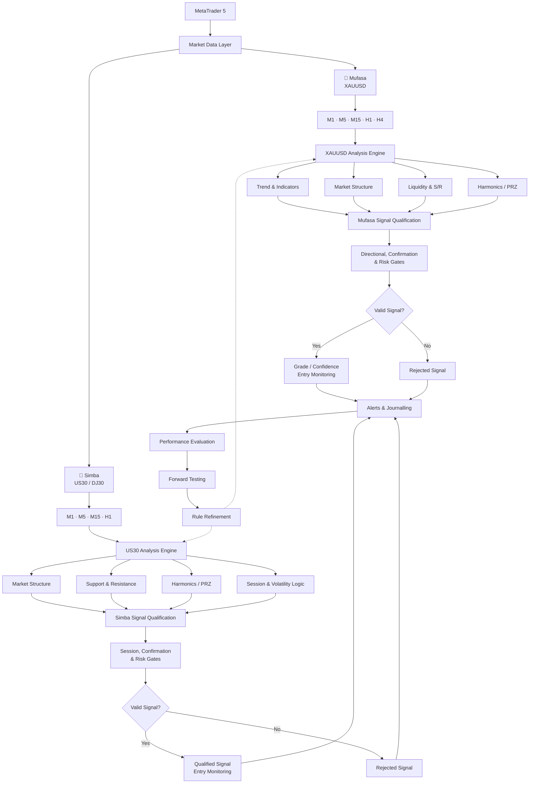

# Hi, I'm Sher 👋

I'm Sher, a London-based developer building explainable algorithmic-trading and market-analysis systems with Python and MetaTrader 5.

My current work focuses on multi-timeframe market analysis, signal qualification, risk controls, testing and trading-system automation.

Before moving into development, I worked in professional kitchens and senior kitchen leadership, which heavily influenced how I approach systems: preparation, structure, consistency and constant refinement.

## Current Projects

### 🐆 Mufasa

**XAUUSD multi-timeframe market scanner built with Python and MetaTrader 5.**

Mufasa is designed to continuously analyse gold across multiple timeframes while separating live market monitoring from closed-candle confirmation.

The system currently analyses:

- M1, M5, M15, H1 and H4 market data
- EMA 20, EMA 50 and EMA 200 trend context
- ATR and RSI market conditions
- Swing highs and lows
- Breaks of structure
- Liquidity sweeps
- Support and resistance
- Harmonic patterns and potential reversal zones
- Multi-timeframe directional alignment
- Entry-zone monitoring
- Signal grading and confidence scoring
- Risk and invalidation conditions
- Trade outcome journalling
- Maximum favourable and adverse excursion analysis
- Rejected-signal analysis
- Forward-testing performance

M1 is primarily used for signal timing, spread monitoring and entry-zone tracking, while higher timeframes provide broader structural and directional context.

The scanner works from completed candles for confirmation, with the current forming candle handled separately for live-price monitoring.

**Current status:** Alert-only and under forward testing. Automated trade execution is intentionally disabled until sufficient validation and performance evidence have been collected.

### 🦁 Simba

**US30 / DJ30 session-aware market scanner built for MetaTrader 5.**

Simba is a separate trading-system project designed specifically around the behaviour and volatility characteristics of the Dow Jones index.

Rather than reusing Mufasa's gold-market assumptions, Simba maintains its own analysis rules, session logic, configuration and performance journal.

Current areas of development include:

- M1, M5, M15 and H1 multi-timeframe analysis
- Market structure and directional context
- Support and resistance
- Harmonic-pattern analysis
- Potential reversal zones
- M15 confirmation logic
- London and New York session controls
- Session-specific volatility handling
- Entry and invalidation logic
- Stop-loss and target modelling
- Signal qualification
- Rejection logging
- Trade-outcome journalling
- Forward-testing and performance evaluation

Particular attention is given to the change in US30 behaviour around the New York session, where volatility can increase significantly compared with earlier trading periods.

Simba is intentionally maintained as a separate system from Mufasa so that rules developed for XAUUSD are not automatically assumed to apply to an equity index.

**Current status:** Alert-only and under development. Automated execution will only be considered after sufficient forward testing and validation.

**US30 / DJ30 session-aware market scanner built for MetaTrader 5.**

Simba is a separate trading-system project designed specifically around the behaviour and volatility characteristics of the Dow Jones index.

Rather than reusing Mufasa's gold-market assumptions, Simba maintains its own analysis rules, session logic, configuration and performance journal.

Current areas of development include:

- M1, M5, M15 and H1 multi-timeframe analysis
- Market structure and directional context
- Support and resistance
- Harmonic-pattern analysis
- Potential reversal zones
- M15 confirmation logic
- London and New York session controls
- Session-specific volatility handling
- Entry and invalidation logic
- Stop-loss and target modelling
- Signal qualification
- Rejection logging
- Trade-outcome journalling
- Forward-testing and performance evaluation

Particular attention is given to the change in US30 behaviour around the New York session, where volatility can increase significantly compared with earlier trading periods.

Simba is intentionally maintained as a separate system from Mufasa so that rules developed for XAUUSD are not automatically assumed to apply to an equity index.

**Current status:** Alert-only and under development. Automated execution will only be considered after sufficient forward testing and validation.

### 💻 SherShell

A PowerShell-based command environment for launching and managing my development and trading tools.

## 🏗️ System Architecture

Mufasa and Simba are maintained as separate market-specific systems, but both follow the same general engineering principle: separate market data, analysis, signal qualification, risk controls and performance evaluation into distinct stages.

### Design principles

* **Market-specific logic:** Mufasa and Simba maintain separate rules rather than assuming behaviour transfers between XAUUSD and US30.
* **Closed-candle confirmation:** Completed candles are used for confirmed analytical decisions, while live price can be handled separately for monitoring and execution timing.
* **Modular analysis:** Indicators, structure, liquidity, harmonic analysis and other components contribute to qualification rather than acting as isolated trade triggers.
* **Explicit rejection:** Failed setups are logged as useful data instead of simply disappearing from the system.
* **Separation of analysis and execution:** Signal generation can be developed and evaluated independently from automated order execution.
* **Continuous evaluation:** Journalling and forward-testing results feed back into later rule refinement.

The objective is not to generate as many signals as possible. The systems are designed to produce decisions that can be explained, reproduced, rejected when necessary and evaluated against real forward-testing results.

## Technologies
## 🛠️ Technologies

- Python
- MetaTrader 5
- PowerShell
- Git
- GitHub

## 📊 Areas

- Algorithmic trading
- Market-data analysis
- Technical analysis
- Automation
- Trading-system evaluation

## Current Focus

I am developing reliable, explainable trading scanners before considering automated execution.

My priorities are:

- Clear system rules
- Strict risk controls
- Reproducible decisions
- Honest performance evaluation
- Continuous testing and improvement

## Background

Before moving into development, I worked in professional kitchens and progressed into senior kitchen leadership.

That background shaped how I approach software: organise the system, prepare properly, test everything and do not serve anything half-finished.
